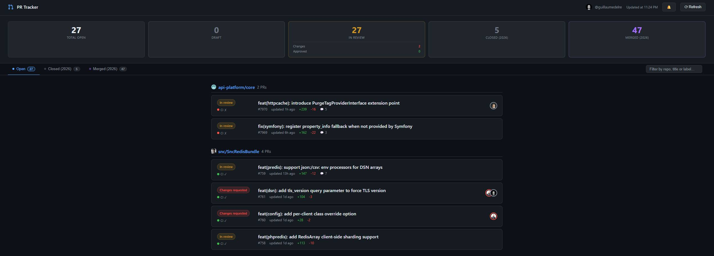

# 🔍 PR Tracker

> Single-page GitHub PR dashboard. No framework, no build step, no dependencies beyond Docker.



---

## ⚙️ How it works

```
Browser  ──GET /──────────────────►  nginx (port 8080)
                                        │
Browser  ──POST /api/graphql ──────►  nginx  ──► api.github.com/graphql
                                        │           (Authorization header added by nginx)
Browser  ──GET  /api/rest/user ────►  nginx  ──► api.github.com/user
```

The [GitHub GraphQL API][gh-graphql] is used to fetch open, merged, and closed PRs in parallel. The [GitHub REST API][gh-rest] is used to resolve the authenticated user's login and avatar. All API calls are made from nginx, which injects the `Authorization: Bearer <token>` header from a Docker secret mounted at `/run/secrets/gh_token`.

A small `config.js` file is generated at container startup from environment variables and served as a static asset alongside `index.html`.

---

## 📋 Prerequisites

- **Docker** with the Compose plugin (`docker compose version`)
- A GitHub [Personal Access Token][gh-pat] with:
  - Classic token: `repo` scope
  - Fine-grained token: **Pull requests: read** + **Metadata: read**

---

## 🚀 Setup

### 1. Clone the repository

```bash
git clone <repo-url>
cd gh-pr-tracker
```

### 2. Create the token secret

```bash
mkdir -p secrets
echo -n "ghp_your_token_here" > secrets/gh_token
```

> ⚠️ The `secrets/` directory is gitignored. Never commit this file.

### 3. Configure environment variables (optional)

```bash
cp .env.example .env
```

Edit `.env` to suit your setup:

| Variable | Default | Description |
|---|---|---|
| `PORT` | `8080` | Host port exposed by the container |
| `REFRESH_INTERVAL` | `300` | Auto-refresh interval in seconds |
| `HIDDEN_NAMESPACES` | `""` | Comma-separated GitHub namespaces (users/orgs) to hide from the dashboard |

`.env` is gitignored and never committed.

### 4. Start the container

```bash
docker compose up -d
```

Open [http://localhost:8080](http://localhost:8080) (or the port you configured).

### 5. Stop

```bash
docker compose down
```

---

## 🛠️ Configuration reference

All variables are read from `.env` at startup via Docker Compose variable substitution. The GitHub token is a Docker secret, not an environment variable (see [Docker Compose secrets][compose-secrets]).

| Variable | Required | Default | Description |
|---|---|---|---|
| `PORT` | No | `8080` | Host port exposed by the container |
| `REFRESH_INTERVAL` | No | `300` | Auto-refresh interval in seconds |
| `HIDDEN_NAMESPACES` | No | `""` | Comma-separated GitHub namespaces (users/orgs) to exclude from the dashboard |

### Adding a new environment variable

1. Add it to `compose.yaml` `environment:` with `${VAR:-default}` syntax and a comment.
2. Read it in `entrypoint.sh` and include it in the `window.PR_TRACKER_CONFIG` object written to `config.js`.
3. Read it from `window.PR_TRACKER_CONFIG` in `index.html`.
4. Add it to `.env.example` with a comment and default value.

---

## ✨ Dashboard features

- 📊 **Stats bar**: total open PRs, draft count, in-review count (with changes-requested and approved sub-counts), closed and merged counts for the current year
- 🔎 **Filters**: Open / Closed (year) / Merged (year) — tabs at the top of the list
- 🔍 **Search**: real-time filter by repo name, PR title, or label (case-insensitive, works across all tabs)
- 🃏 **PR cards**: review status badge, CI status dot, reviewer avatars with review-state color, diff stats, GitHub labels, relative timestamp
- 📄 **Pagination**: 10 repo groups per page, "Show more" button to load the next batch
- 🔄 **Auto-refresh**: configurable interval via `REFRESH_INTERVAL` (default: 5 minutes)
- 🔔 **Browser notifications**: click the 🔕 button in the header to enable. A notification fires on CI status change (passed/failed) or review decision change (approved/changes requested). No notification on the first load.

---

## 🔒 Security notes

- The GitHub token is stored as a Docker secret and loaded into the nginx process environment only. It is injected as an HTTP header by nginx and never sent to the browser.
- `secrets/` and `.env` are gitignored. Do not commit token or credential files.
- The dashboard is intended for local or internal network use. There is no authentication layer in front of it.
- If the token is missing or empty at startup, the container exits immediately with a clear error message (check `docker compose logs web`).

---

## 🔄 Updating

Pull the latest changes, then apply them depending on what changed:

```bash
git pull
```

| What changed | Action required |
|---|---|
| `index.html` only | Hard-refresh the browser (`Ctrl+Shift+R`) — no restart needed |
| `entrypoint.sh`, `compose.yaml`, `nginx.conf.template` | `docker compose down && docker compose up -d` |

Your token (`secrets/gh_token`) and your `.env` configuration are never touched by an update.

---

## 🐛 Troubleshooting

**The dashboard shows an error banner on load**

The most common causes:

| Error message | Cause | Fix |
|---|---|---|
| `Invalid or expired GitHub token` | Token in `secrets/gh_token` is wrong or has expired | Replace the token and restart: `docker compose down && docker compose up -d` |
| `GitHub token lacks required permissions` | Token scope too narrow | Generate a new token with the correct permissions (see Prerequisites) |
| `Unexpected HTTP 5xx` | GitHub API outage or nginx misconfiguration | Check [githubstatus.com][gh-status] and `docker compose logs web` |

**The container exits immediately**

Check the logs: `docker compose logs web`. If the error is `GitHub token is missing or empty`, the file `secrets/gh_token` is absent or empty. Create it and restart.

**Port already in use**

Set a different port in `.env`:

```bash
echo "PORT=9090" >> .env
docker compose down && docker compose up -d
```

---

## 🧑‍💻 Development

The entire frontend is a single file: `index.html`. There is no build step. Edit it directly and refresh the browser. The container must be running for API calls to work.

To restart the container after changing `entrypoint.sh`, `compose.yaml`, or `nginx.conf.template`:

```bash
docker compose down && docker compose up -d
```

> Changes to `index.html` are picked up immediately without restarting (it is bind-mounted read-only).

---

[gh-graphql]: https://docs.github.com/en/graphql
[gh-rest]: https://docs.github.com/en/rest
[gh-pat]: https://docs.github.com/en/authentication/keeping-your-account-and-data-secure/managing-your-personal-access-tokens
[compose-secrets]: https://docs.docker.com/compose/how-tos/use-secrets/
[gh-status]: https://www.githubstatus.com/
